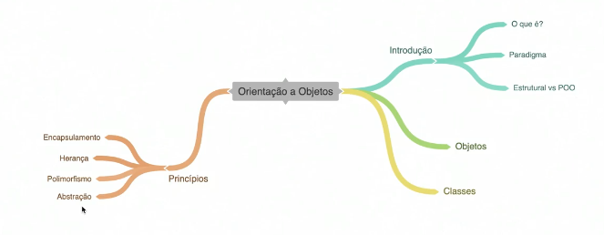

# Programação Orientada a Objeto

 Utilizados para padrões de projetos pensados em POO

## Objetos
Todos objetos possuem:
  - Propriedades e Funcionalidades
  - Estado e comportamentos
  - Atributos e Métodos

## Classes
 Objetos são criados a partir de classes, é a estrutura para gerar o objeto.
 
 - Funcionalidade
   - **\#** funciona como um **private** dentro da classe
 - x

 ## Encapsulamento
 Agrupar parecidos, camada segurança para os atributos e metodos.
 Dirigir carro x Conhecer como funciona o motor do carro

## Herança
Copia de caracteristicas, propriedades, métodos de uma **classe pai** para uma **classe filha**

## Polimorfismo
 Recebe como uma herança porem recriando suas caracteristicas.

 ## Abstração
 Significa a criação de uma estrutura (Template) e implementa no herdeiro.