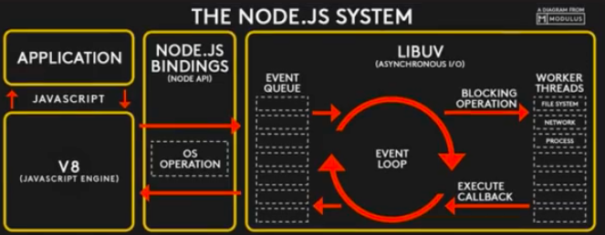

# Trilha introdutória ao NodeJS

## Informações
 - Não recomendado para requisições ou tarefas de muito processamento, como tratamento de videos, etc.

 ## Funcionamento:

 ## Entrada saida

  - Stdout
  - stdin
 