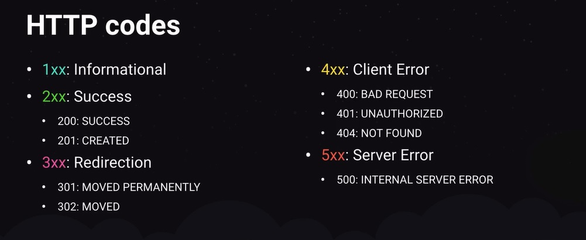

HTTP Codes:

# Algumas aplicações e informações sobre Repository, Services e Patterns

## Repository

O Repository é um conceito introduzido no Data Mapper Pattern ou Repository Pattern que consiste em uma ponte entre nossa aplicação e a fonte de dados, seja ela um banco de dados, um arquivo físico ou qualquer outro meio de persistência de dados da aplicação.

Essa implementação visa isolar a forma com que nos comunicamos com os dados, abstraindo lógicas comuns de operações no banco.

Geralmente o Repository possui os métodos comuns de comunicação com uma fonte de dados como listagem, busca, criação, edição, remoção, mas conforme a aplicação cresce o desenvolvedor tende a encontrar outras operações repetitíveis e, com isso, popula o repositório com mais funcionalidades.

## Service

O Service é um conceito introduzido no Service Pattern. Ele tem como objetivo abstrair regras de negócio das rotas, além de tornar nosso código mais reutilizável.

No contexto da nossa jornada, essa implementação visa reduzir a complexidade das rotas da nossa aplicação e deixá-las responsáveis apenas pelo que realmente devem fazer: receber uma requisição, repassar os dados da requisição a outro arquivo e devolver uma resposta.

O Service deve ter um nome descritivo (ex.: updateDeliveryManProfileService) e **sempre** possuir apenas **um** método (ex.: execute()). Além disso, caso outra rota ou arquivo precise executar essa  mesma ação, basta chamar e executar esse Service, obedecedo assim a outro importante princípio: DRY (Don't Repeat Yourself).

- **SoC (Separation of Concerns)**: Esse princípio zela pela separação de responsabilidades de cada arquivo. Exemplo: as rotas não devem ser responsáveis por lidar com a persistência dos dados, isso fica por conta do Repository. Já o Repository não é responsável pela tratativa das regras de negócio, isso é responsabilidade dos Services;
- **DRY (Don't Repeat Yourself)**: Esse princípio zela pelo maior reaproveitamento de código. Esse princípio não preza necessariamente pela não-repetição de código e sim regras de negócio. Exemplo: ao criar Services e Repositories, você possibilita a reutilização desses códigos no restante da aplicação;
- **SRP (Single Responsability Principle)**: Esse princípio zela que uma classe deve possuir apenas uma responsabilidade. Exemplo: Ao criar um service chamado `createTransactionService`, devemos garantir que no seu único método (execute()) seu trabalho seja **apenas** a criação de uma transação;
- **DIP (Dependency Inversion Principle)**: Esse princípio zela que uma entidade dependa apenas de abstrações, não de implementações. Exemplo: Ao atribuir ao Repository a comunicação com o Banco de dados, o Service precisa interagir apenas com essa abstração, sem precisar criar uma nova instância e realizar as ações diretamente;

